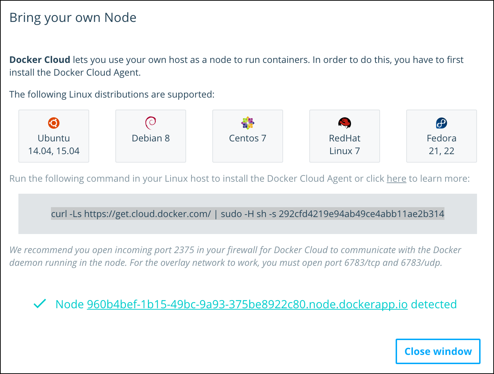
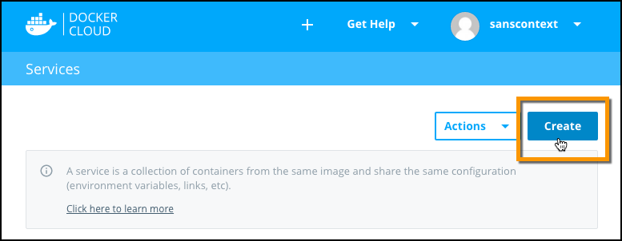
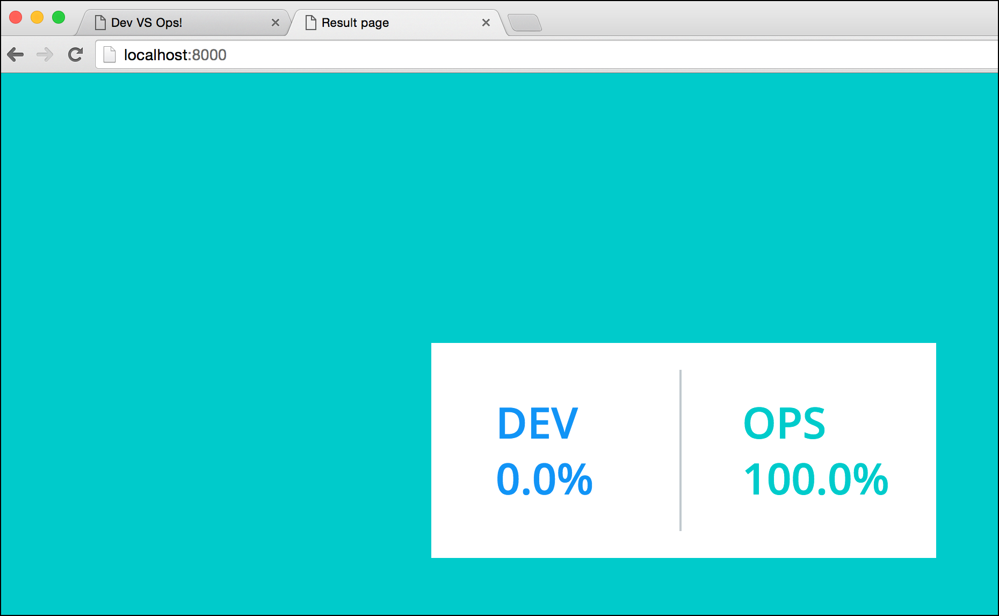
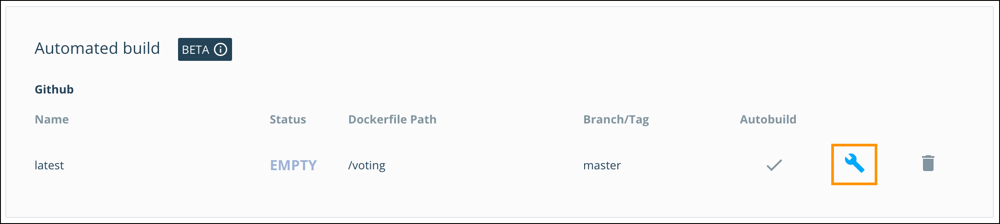
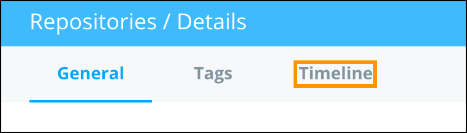
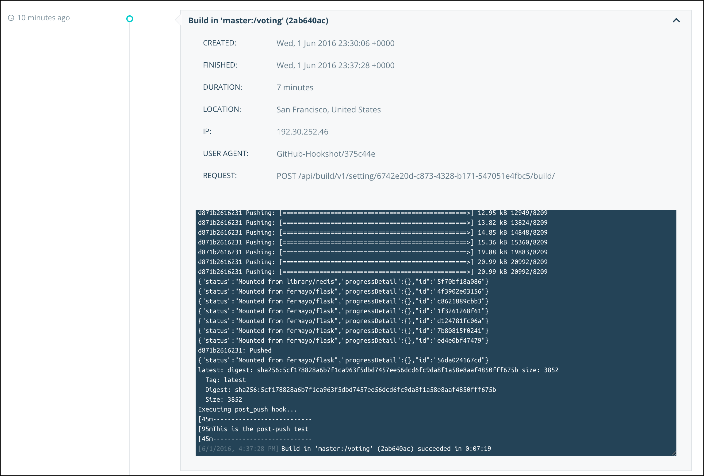

# Lab 4: Docker Cloud

##IMPORTANT: If you intend to do the Universal Control Plane lab today, you should do that BEFORE completing this lab.


> **Difficulty**: Beginner

> **Time**: Approximately 40 minutes

In this lab you will deploy a web application using Docker Cloud. You will complete the following tasks as part of the lab:

- [Configure the prerequisites](#prerequisits)
- [Install the Docker Cloud CLI on a management host](#cli-install)
- [Deploy the Docker Cloud agent on a Docker host](#install_node)
- [Deploy a service](#deploy_service)
  - [Check the service](#check_service)
- [Deploy an application using a CI/CD pipeline](#deploy_app)
  - [Configure Docker Cloud autobuilds](#autobuild)
  - [Test autobuilds](#test_autobuild)
  - [Configure and test autodeploy](#autodeploy)

## What is Docker Cloud?

Docker Cloud is a SaaS-based service for deploying and managing Dockerized applications. Docker Cloud makes it easy for you to manage and deploy the full spectrum of applications, from single container apps to distributed microservices stacks, to any cloud or on-premises infrastructure.

## <a name="prerequisites"></a>Prerequisites

In order to complete this lab you will need all of the following:

- A Docker ID
- A management host (you can use your laptop or one of the nodes from your lab)
- A GitHub account
- Git installed locally on your machine

### Obtain a Docker ID

If you do not already have a Docker ID, you will need to create one now. Creating a Docker ID is free, and allows you to access both [Docker Cloud](https://cloud.docker.com) and [Docker Hub](https://hub.docker.com).

If you already have a Docker ID, skip to the next prerequisite.

To create a Docker ID:

1. Use your web browser to visit [`https://cloud.docker.com`](https://cloud.docker.com)

2. Near the bottom middle of the screen click `Create Account`

3. Choose a Docker ID, supply your email address, and choose a password

4. Click `Sign up`

5. Check your email (**including your spam folder**) for an email with the subject `Please confirm email for your Docker ID`

6. Click the `Confirm Your Email` link in the body of the message

7. You should be redirected back to `https://cloud.docker.com`

You now have a Docker ID. Remember to keep the password safe and secure.

### Choose a management host

As part opf this lab you will need a designated machine that has the Docker Cloud CLI installed. The remainder of this document will refer to this as the *management host*. You have two option for this:

####Option 1 (recommended): Use your own laptop
Install the Docker for Mac or Docker for Windows beta on your laptop and use this as your *management host*. If you'd like to do this please refer to **_need names for relevant portion of D4W and D4M labs_** and follow the instructions there.  ***FAO MIKE we still need this previous sentence nailing down with links etc.***

> **Note**: If you choose this option, you will install the Docker Cloud CLI and execute commands in a terminal or command window on your laptop.

####Option 2: Use an Azure-based virtual machine
If you do not wish to install any software locally, you will need to:
	- SSH into **Second v1.11 node**, 
	- Add the local user to the Docker group

> **Note**:	If you choose this option, you will install the Docker Cloud CLI and execute commands on **Second v1.11 node**.  

To configure `Second v.1.11 node` as your *management host*:

1. Use the following command to SSH into **Second v1.11 node** of your lab, substituting the information you received via email. 
	  
	For example:
	  		
		$ ssh labuser@v111node1-0e23927a6fc9472089bf4c7aeca47ca2-3.cloudapp.net
	  		
	 When prompted enter the password for **Second v1.11 node** provided in your welcome email. 
  	
1. Add the local user to the Docker group on **Second v1.11 node** by typing the following:
	 
		$ sudo usermod -aG docker <username>
	
	Enter the password for **Second v1.11 node** if prompted	
	
	The output should be similar to this:
	
	```	
	$ sudo usermod -aG docker labuser
	[sudo] password for labuser:
	sent invalidate(passwd) request, exiting
	sent invalidate(group) request, exiting
	```	
	
1. Exit the current session by entering the `exit` command

1. SSH back into **Second v1.11 node** by repeating step 1

1. Validate everything is working by checking your Docker version

	```
	$ docker version
	Client:
	 Version:      1.11.2
	 API version:  1.23
	 Go version:   go1.5.4
	 Git commit:   b9f10c9
	 Built:        Wed Jun  1 21:47:50 2016
	 OS/Arch:      linux/amd64
	
	Server:
	 Version:      1.11.2
	 API version:  1.23
	 Go version:   go1.5.4
	 Git commit:   b9f10c9
	 Built:        Wed Jun  1 21:47:50 2016
	 OS/Arch:      linux/amd64
	```

		
  
### GitHub account

In order to complete the CI/CD portions of this lab, you will need an account on GitHub. If you do not already have one you can create one for free at [GitHub](https://github.com).

Continue with the lab as soon as you have completed the prerequisites.

### Git installed 
If you are using your own laptop for you *management host*, you'll need to make sure you have `git` installed (it's already installed if you are using `Second v.1.11 node`). 

Visit <a href="https://git-scm.com/book/en/v2/Getting-Started-Installing-Git">the git website</a> for information how how to install `git`

# <a name="cli-install"></a>Step 1: Install the Docker Cloud CLI

In this step you will install the Docker Cloud Command Line Interface (CLI) on your *management host*.

The Docker Cloud CLI allows you to interact directly with Docker Cloud, and you will be using it, along with the Docker Cloud web UI, as part of this lab.

Installing the Docker Cloud CLI differs based on the operating system of your *management host*.

1. Make sure you are logged on to your *management host* (local terminal/command window if using Docker for Mac or Docker for Windows, or an SSH session to **Second v1.11 node**).

2. Install the `docker-cloud` CLI.

  **Linux and Windows systems:** Execute the following command (if you do not have pip installed, you will be prompted to install it using the command `sudo apt-get install python-pip`)

		$ sudo pip install docker-cloud

  **Mac OS X:** Execute the following command (you will need to have `Brew` installed)

		$ brew install docker-cloud

4. Verify the install by typing `docker-cloud -v`. This will show the version of the Docker Cloud CLI running on your system.

		$ docker-cloud -v
		docker-cloud 1.0.4

You now have the Docker Cloud CLI installed on your *management host* and are ready to start using Docker Cloud.

> **Note**: You can uninstall the Docker Cloud CLI by running `pip uninstall docker-cloud` on Linux and Windows, or `brew uninstall docker-cloud`on OS X.

# <a name="install_node"></a>Step 2: Deploy the Docker Cloud Agent on a Docker host

*Docker hosts* that are managed by Docker Cloud are called *nodes*. In this step you will install the Docker Cloud agent on a *Docker host* and register it as a *node* with Docker Cloud. Later in the lab you will use Docker Cloud to deploy containers to this node.

Docker Cloud allows you to easily spin up new instances on various cloud platforms and deploy the Docker Cloud agent to them so that they can be Docker Cloud nodes. It also let's you deploy the agent to **existing** Docker hosts so that they can also be Docker Cloud nodes.

In this step you'll deploy the Docker Cloud agent to an existing Docker host - **First v1.11 node** in your lab.

> **Note** that this is **First v1.11 node** which is different to **Second v1.11 node** that you *may* have used for your *management host* in the previous step.

1. Navigate to [`https://cloud.docker.com`](https://cloud.docker.com) and login with your Docker ID.

2. Click the **Create a Node** icon on the welcome screen

	

3. Click **Bring your own node**

	

4. The dialog that appears lists the supported Operating Systems and provides the command that you will use to deploy the Docker Cloud agent. The command includes a token that allows the agent to communicate and register with Docker Cloud.

    

5. Copy the command to your clipboard.

6. Open a terminal window and SSH into **First v1.11 node**

		ssh <username>@<First v1.11 DNS name>

7. Paste the command onto the command prompt on **First v1.11 node**

		$ curl -Ls https://get.cloud.docker.com/ | sudo -H sh -s c7a941OHAIac9419e837f940fab9aa4f1
  **Remember to cut and paste the command and token from the Docker Cloud UI and not the one form the example above.**

    The command downloads a script which installs and configures the Docker Cloud agent and registers the host as a *node* with Docker Cloud.

    Upon completion you should see something similar to:

    ```
    -> Configuring dockercloud-agent...
    -> Starting dockercloud-agent service...
	dockercloud-agent start/running, process 1893
	-> Done!

	*******************************************************************************
	Docker Cloud Agent installed successfully
	*******************************************************************************

	You can now deploy containers to this node using Docker Cloud
	```


6. Switch back to your web browser and confirm that the new Linux host is detected as shown below.

	

7. Click **Close Window**

You have successfully added **First v1.11 node** as a Docker Cloud *node*. This means Docker Cloud can manage **First v1.11 node** and deploy containers to it.

# <a name="deploy_service"></a>Step 3: Deploy a Service

In this step you will use the Docker Cloud web UI to deploy a simple application comprising a single *service*.

A *service* is a group of containers based off the same tagged image (`image:tag`). Services make it simple to scale your application. With Docker Cloud, you simply drag a slider to scale the number of containers in a service up and down.

When you create a service in the Docker Cloud web interface, a wizard walks you through configuring the service in three steps.

+ **Step 1 - Choose a Container Image:** Docker Cloud supports images form public and private repos on Docker Hub and thid party registries. It also provides a set of *Jumpstart* repos that are designed to make deploying simple applications easy.
+  **Step 2 - Configure the Service:** Services have verious proerties and values that need setting. These include: a service a name, initial number of containers, which ports to expose/publish, the entrypoint command, memory and CPU limits.
+  **Step 3 - Set Environment variables:** Each service has a set of environment variables that are used to configure the service, such as linking your service to other services in Docker Cloud.

> **Note**: In this lab  we won't be working with environment variables or connecting data volumes, but these are also available as optional steps in the wizard.

Let's get started by selecting a service to deploy.

1. Click the **Services** link in the menu on the left hand side of the Docker Cloud web UI.

	

2. Click **Create**.

	

3. Click the rocket icon near the top of the page and click on the **dockercloud/hello-world** image from the **Miscellaneous** section.

  This will take you to the **Services\Wizard** page.

    

  The **dockercloud/hello-world** image creates a container (service) that runs an NGINX web server that displays a simple *hello world* web page.

  For the purposes of this lab, the only modification you need to make on this page is to expose a port and map it to a node (host) port. Let's do that.

4. Scroll down to the **Ports** section and place a check in the **Published** checkbox.

	

5. Replace **dynamic** with "8080" and click **Add port**.

	> **Note**: Two containers on the same node cannot publish to the same port. If you have completed other labs that already have a container on the node using port 8080, this operation will fail.

6. Click **Create and deploy**.

> **FAO MIKE: The service won't deploy using the new web UI. But it deploys fine using the old one.  I've tried several times now and the only way I can get it to launch in the new UI is if I DONT publish a port. Weird and may be one to raise with the team if you have the same issue.**

  Docker Cloud will now create and deploy service. This may take a minute or two while the image is downloaded and the container deployed.


Once the service is deployed you will be shown the detailed view of the Service. This view contains six informational sections:

  - **Containers**: lists the containers that are part of this service and their status. This is also where you'd go to scale the number of containers in the service up or down.
  - **Endpoints**: shows a list of available service and container endpoints.
  - **Triggers**: allows you to set triggers that perform automatic actions such as scaling a node or redeploying an image when the source updates.
  - **Links**: lists the links between services. For this tutorial this section will be empty.
  - **Volumes**: lists the volumes attached to the service to store data. For this tutorial this section will be empty.
  - **Environment Variables**: lists the environment variables for the service.

Two additional tabs of information are available for each service:

  - **Logs**: shows the recent logs from all the containers in this service.
  - **Timeline**: a timeline of API calls, and accompanying logs, that were performed against the service.

The service is now deployed and can be reached over the internet on port 8080.

## <a name="check_service"></a>Step 3.1: Check the service

Let's make sure the service is up and listening for requests.

Make sure you are logged in to the Docker Cloud web UI and on the details page of the service deployed in the previous step.

1. Click the **Timeline** tab and select **Service Start** to see a log output similar to the one below.

	> **Note**: It can take a couple of minutes for the container to deploy.

	

2. Click back onto the **General** tab

	Notice that the hello-world status line shows as **Running** once the service is deployed successfully.

	The **Containers** list further down the **General** tab shows all of the containers in this service. There should just be one for now.

	

3. Click the container's name to go to the container's detail view.

	From this page you can see additional information about the container, such as endpoints, logs, environment variables, volumes, a terminal, and the containers own timeline.

	

	The **Endpoints** section lists the endpoints (ports) that this container is listening on. In the screenshot above, there is a single endpoint: **hello-world-66622790-1.9ab56d66.container.docker.io:8080**. The endpoint is composed of both the container's hostname and a port number.

4. Click the small link icon in the **Endpoints** section to open a new browser tab to the applications home page. You will see the **hello-world** message and the ID of the container that responded to the request (at this point the service only has one container).

	

    You can also click the **Service Endpoint** from the Service's detailed view. The main difference between *service endpoints* and *container endpoints* is that service endpoints load balance across all containers that are part of the service.

**Congratulations!** You've successfully deployed your first service using Docker Cloud.


# <a name="deploy_app"></a>Step 4: Deploy and application using a CI/CD pipeline

One of the most powerful features of Docker Cloud is the ability to define end-to-end CI/CD pipelines. In this part of the lab you're going to link your GitHub account to Docker Cloud to facilitate seamless application delivery.

In order to complete this step you'll need to:
- be logged in to GitHub
- have Docker Cloud linked to your GitHub account
- have `git` installed on your *management host*

To link Docker Cloud with GitHub, click your account name in the top right corner of the Docker Cloud web UI. Click **Account settings** and then the **Source providers** link. Click the **power socket** icon and follow the procedure to link your GitHub account.

Now that you've got Docker Cloud linked to your GitHub account We'll start by forking a demo repo.

1. In your web browser navigate to <a href="https://github.com/Cloud-Demo-Team/voting-demo.git"> https://github.com/Cloud-Demo-Team/voting-demo.git</a>.

2. Click the **Fork** button in the upper right hand corner to create your own copy of the repository.

Now we'll clone the repository into our local Docker environment. The following commands will be executed in the terminal or command window for your *management host*.

> Be sure to be logged on and running the next commands from your *management host* and not your *node*.

3 Change to your home directory

  `$ cd` (for Linux machines)

  `$ cd %userprofile%` (for Windows machines)

4. Clone the repository (you will need to have `git` installed and the `git` binary present in your PATH)

		$ git clone https://github.com/<your github user name>/voting-demo.git

		Cloning into 'voting-demo'...
		remote: Counting objects: 481, done.
		remote: Total 481 (delta 0), reused 0 (delta 0), pack-reused 481
		Receiving objects: 100% (481/481), 105.01 KiB | 0 bytes/s, done.
		Resolving deltas: 100% (246/246), done.
		Checking connectivity... done.

  This will create a copy of the forked repo in a directory called `voting-demo` within your home directory.

5. Change directory into the repo directory

		`$ cd voting-demo`

6. List the directory contents

  Linux: `$ ls`

  Windows: `$ dir`

	The various YAML files define how the application will be deployed in various environments such as production and staging.

    If you open `docker-compose.yml` you will see that it defines an app with 4 services:

	+ **votinglb**: A load balancer based on HAProxy
	+ **voting**: A web front end to allows users to cast votes
	+ **results**: A web front end that allows you to see the results of the vote
	+ **redis**: A persistent data store for storing voting data

7. Test the application locally

		$ docker-compose up -d

	This will start the application on you *management host*. You will see Docker Compose build several images and ultimately finish with something like this:

		Creating votingdemo_redis_1
		Creating votingdemo_voting_1
		Creating votingdemo_results_1
		Creating votingdemo_votinglb_1

8. Check to see if the voting front end is working by navigating to `http://localhost` in your web browser.

  If this does not work, run a `docker ps` command and open your web browser to the IP address shown next to the `votingdemo_votinglb_1` container

	> **Note**: The voting app is running on port 80

	

9. Check to see if the results front end is working by opening a new tab in your browser to `http://localhost:8000`.

  If you had to specify the IP address in the previous step, use the same IP address but append `:8000` to the end.

	> **Note**: You will not see any results until you cast a vote using the voting front end. As you change your vote you can move back to results screen to see the results change.

	

Congratulations! You have successfully deployed a simple web app using Docker Cloud.

# <a name="autobuild"></a>Step 4.1: Configure autobuilds

Docker Cloud can automatically build new images when updates are pushed to a repository on GitHub.

In this step you're going to build two GitHub repositories - one for the **voting** part of the app and one for the **results** part. You'll configure them both so that each time a change is pushed to them an updated Docker image will be built.

1. In your web browser return to Docker Cloud and click the **Repositories** link on the left hand side.

	

2. Click **Create** near the top right of the page

3. Enter the following information

	+ **Name**: Results
	+ **Description**: Results service for the Docker voting app

4. Click **Create**

	You'll be taken to the details page for ythe new repository. From here you're going to link your GitHub repository and instruct Docker Cloud to rebuild the image whenever a change is pushed to GitHub.

5. Click **Edit repository** near the top right of the repository details page

6. Select the **Build** tab and click the **Link to GitHub** button
**FAO MIKE Might wanna have an image that shows the Link to GitHub screen.**

7. Make sure the appropriate organization is populated, and enter **voting-demo** for repository

8. Enter **/results** for the Dockerfile path.

9. Make sure **Autobuild** is selected. This is the switch that tells Docker Cloud to build a new image every time a change is *pushed* to GitHub

	**FAO MIKE The image shown is only very slightly different to the latest version so might be worth keeping as is.**

10. Click **Save**.

  There should be a pop up notification letting you know that GitHub was successfully pinged.

11. Click the blue wrench to trigger an initial image build.

  <image below not working>
	
  It may take a minute or so for the build to complete.

Repeat steps 1-11 with the following modifications:

  Create Repo (Step 3)
  + **Name**: Voting
  + **Description**: Voting service for the Docker voting app

Specifying the Dockerfile path (Step 8)
  + Enter **/voting** for the Dockerfile path

Well done! You've created two new repos and configured them to autobuild whenever new changes are pushed to the associated GitHub repos.

# <a name="test_autobuild"></a>Step 4.2: Test autobuilds

Switch back the command line of your *management host*. If you are not in the `voting-demo` directory that was created when you cloned the repo earlier, change into it now.

1. Change to the voting directory

		$ cd voting

2. Use vi or your favorite text editor to open `app.py`
  + To use `vi` on Linux: `$ vi app.py`
  + To use `notepad.exe` on Windows: `$ notepad app.py`

3. Scroll down to find the lines containing `optionA` and `optionB`, and change **Dev** and **Ops** to **Futbol** and **Soccer**

		optionA = "Futbol"
		optionB = "Soccer"

4. Save your changes

5. Commit changes to the repository and push to GitHub using `git add`, `git commit`, and `git push`

		$ git add *

		$ git commit -m "changing the voting options"
		[master 2ab640a] changing the voting options
 		1 file changed, 3 insertions(+), 2 deletions(-)

 		$ git push origin master
 		Counting objects: 4, done.
		Delta compression using up to 8 threads.
		Compressing objects: 100% (4/4), done.
		Writing objects: 100% (4/4), 380 bytes | 0 bytes/s, done.
		Total 4 (delta 3), reused 0 (delta 0)
		To https://github.com/<your github repo>/voting-demo.git
   		c1788a1..2ab640a  master -> master

  >**Note:** If you have two factor authentication (2FA) configured on your GitHub account you will need to enter your personal access token (PAT) instead of your password when prompted.

6. In the Docker Cloud web UI, navigate back to the **voting** repo and notice that the status is **BUILDING**.

	> **Note**: It can take several minutes for a build job to complete

	

1. Click the **Timeline** tab near the top of the screen

	

1. Click `Build in master:/voting`

	Here you can see the status of the build process

	

Congratulations. You have configured your Docker Cloud to build a new Docker image each time you push a change to your application's repository on GitHub.

# <a name="autodeploy"></a>Step 4.2: Configure automated deployments

Now that you have Docker Cloud configured to update your images whenever new code is pushed to GitHub, you will configure the voting application to redeploy each service anytime the underlying image is changed.

The overall flow is as follows: Push changes to GitHub -> Autobuild of the affected Docker Cloud image -> Automatically redeploy the service that uses that image -> Application up to date!

Applications deployed on Docker Cloud are referred to as **Stacks** and are defined by a YAML file much like they are with Docker Compose. In this step you will be using the `docker-cloud.yml` file inside the `voting-demo` directory that you cloned earlier. The contents of the file are listed below.

		redis:
  			image: 'redis:latest'
		results:
  			autoredeploy: true
  			image: 'cloudorg/results:latest'
  			links:
   	 			- redis
  			ports:
    			- '8000:80'
  			restart: always
		voting:
			autoredeploy: true
		  	image: 'cloudorg/voting:latest'
		  	links:
		  	  	- redis
		  	restart: always
		  	target_num_containers: 4
		votinglb:
			image: 'dockercloud/haproxy:latest'
		  	links:
		  		- voting
		  	ports:
		  		- '80:80'
		  	roles:
		    	- global

This file, like the Docker Compose file we ran earlier, will stand up four services. But there are a couple of things to note:

+ The inclusion of the **autoredploy** flag will cause both the **voting** and **results** services to be automatically redeployed if the underlying image is changed.
+ The **target_num_containers** flag in the **voting** service will ensure that the service initially starts with four containers.

Let's go ahead and deploy the application.

1. On your *management host* Change into the `voting-demo` directory

		$ cd ~/voting-demo

2. Use `vi` or your favorite text editor to modify the `docker-cloud.yml` file. Currently the images for **voting** and **results** are pointing at the **cloudorg** organization. You need to replace **cloudorg** with your Docker ID.

		results:
  			autoredeploy: true
  			image: '<your Docker ID>'/results:latest'

	and

		voting:
			autoredeploy: true
		  	image: '<your Docker ID>/voting:latest'

	> **Note**: You do NOT need to change the organization for the **haproxy** image.

3. Authenticate to Docker

		$ docker login
		Login with your Docker ID to push and pull images from Docker Hub. If you don't have a Docker ID, head over to https://hub.docker.com to create one.
		Username: <your Docker ID>
		Password: <your Docker ID password>
		Login Succeeded

4. Start the stack using the Docker Cloud CLI

		$ docker-cloud stack up
		5087205f-80c5-498a-9005-0ff9a29e48f0

	> **Note**: You can also stand up stacks form the **Stacks** page of the Docker Cloud web interface.

5. Back in the Docker Cloud web UI, click the **Stacks** icon in the left hand menu.

	

	You should see your Stack running.

	

6. Click on the stack name - `voting-demo`

7. Scroll down to the **Endpoints** section and click on the small link icons at the end of the two lines under **Service Endpoints**

  Notice the voting app now says "Futbol VS Soccer" instead of "Dev vs Ops". This is the result of the change we made earlier.

	> **Note**: As before you won't see anything on the results page until you vote.

Now that you have your application up and running, let's push a change to GitHub and watch Docker Cloud redeploy the application.

8. Switch back to your terminal or command window on your *management host*.

9. Change to the voting directory

		$ cd ~/voting-demo/voting

10. Use vi or your favorite text editor to open `app.py`

		$ vi app.py

11. Scroll down to find the lines containing `optionA` and `optionB`, and change **Futbol** and **Soccer** to **Seattle** and **San Francisco**

		optionA = "Seattle"
		optionB = "San Francisco"

12. Save your changes

13. Commit changes to the repository and push to GitHub using `git add`, `git commit`, and `git push`

		$ git add *

		$ git commit -m "changing the voting options"
		[master 2ab640a] changing the voting options
 		1 file changed, 3 insertions(+), 2 deletions(-)

 		$ git push origin master
 		Counting objects: 4, done.
		Delta compression using up to 8 threads.
		Compressing objects: 100% (4/4), done.
		Writing objects: 100% (4/4), 380 bytes | 0 bytes/s, done.
		Total 4 (delta 3), reused 0 (delta 0)
		To https://github.com/<your github repo>/voting-demo.git
   		c1788a1..2ab640a  master -> master

14. Switch back to Docker Cloud in your web browser

15. Click **Repositories** in the left-hand menu

16. Navigate to the **voting** repository and click the repository name

17. Notice the status is flashing **BUILDING**

	> **Note**: It can take several minutes for a build job to complete

	

18. Click the **Timeline** tab near the top of the screen

	

19. Click the running task `Build in master:/voting`

	Here you can see the status of the build process

	

20. Once the build finishes you can click on the **Services** link in the left hand menu and see the **voting** service and the **results** service *redeploying*.

  It only takes a few seconds to redeploy each service, so you may miss this.

21. Once both services have redeployed with the updated images, if you refresh the **voting** and **results** web pages (you should still have a tab open for each of them) you will see that the values now show as **Seattle** and **San Francisco**.

Congratulations! You have successfully deployed an application and configured it to automatically redeploy any time changes are pushed to its GitHub repo.

This completes the Docker Cloud lab.
