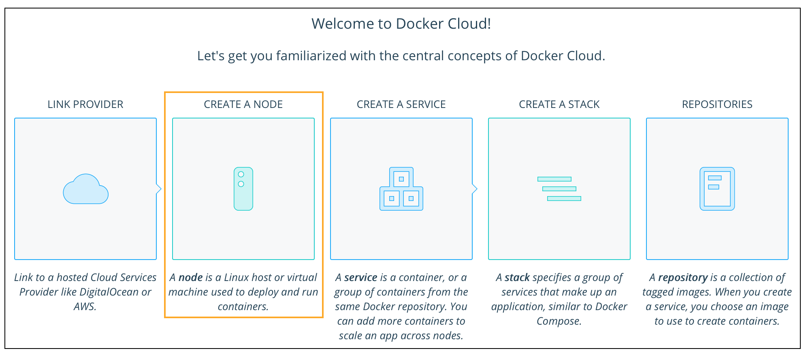
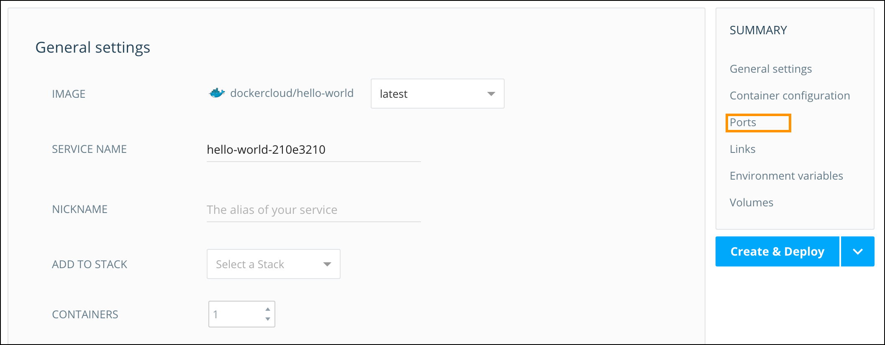
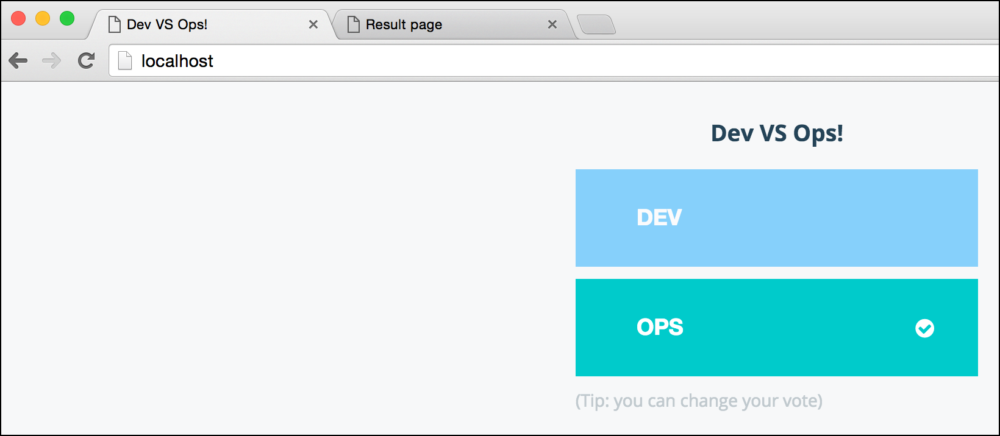

# Lab 4: Docker Cloud

> **Difficulty**: Beginner

> **Time**: Approximately 40 minutes

> **Tasks**:
> 
> + [Prerequisites](#prerequisites)
> 
> 	+ [Install the Docker Cloud CLI](#cli-install)
> 	+ [Install the Docker Cloud Agent on a Node](#install_node)
> 	+ [Deploy a service](#deploy_service)
> 	+ [Setup a CI/CD pipeline and deploy a multi-service application](#deploy_app)

## What is Docker Cloud?
Docker Cloud is a hosted service that provides a Registry with build and testing facilities for Dockerized application images, tools to help you set up and manage your host infrastructure, and deployment features to help you automate deploying your images to your infrastructure.


## <a name="prerequisites"></a>Prerequisites

### Obtain a Docker ID

If you do not already have a Docker ID, you will need to create one now. Creating a Docker ID is free, and allows you to access both Docker Cloud and Docker Hub. 

To create a Docker ID:

1. Use your web browser to visit `http://cloud.docker.com`

2. Near the bottom middle of the screen click `Create Account`

3. Choose a Docker ID, as well as supply your email address, and choose a password

4. Click `Sign up`

5. Check your email (**including your spam folder**) for an email with the subject `Please confirm email for your Docker ID`

6. Click the `Confirm Your Email` link in the body of the message

7. You should be redirected back to `https://cloud.docker.com`


### Choose a local Docker environment

Before beginning this lab, you will need to select an option for working with a local Docker environment 

**Option 1 (recommended)**: We recommend that you install the Docker for Mac or Docker for Windows beta on your laptop. If you'd like to do this please refer to TODO: **_need names for relevant portion of D4W and D4M labs_** and follow the instructions there. 

If you choose this option, you will install the Docker Cloud CLI and execute commands in a terminal or command window on your local machine.

**Option 2**: If you do not wish to install any software locally, you will need to SSH into `node-2` to install the Docker Cloud CLI and execute any commands.  To SSH into `node-2` type the following, substituting the information provided to you over email. 

	ssh -i <your ssh key name>.pem <username>@<node-2 ip address>

### GitHub or BitBucket Account

In order to complete the CI/CD portions of this lab, you will need an account on either GitHub or BitBucket. Please visit the site of your choosing, and create an account if you do not already have one. 


## <a name="cli-install"></a>Step 1: Install The Docker Cloud CLI

Docker Cloud provides a Command Line Interface (CLI) tool that you can use
to interact with the service. We will be using this tool, along with Docker Cloud's web interface as part of this lab today

Installing the Docker Cloud CLI differs based on the operating system you're using. Be sure to use the correct step below (Step 2 for Linux and Windows, Step 3 for Mac OS X()

1. Make sure you are in your chosen local Docker environment. You're either in a local terminal or command window and are using Docker for Mac or Docker for Windows OR you have used SSH to access `node-2` 

2. For Linux and Windows sytems: Execute the following commands on your command line

		$ pip install docker-cloud

3. For Mac OS X: Exectute the following commands (you will need to have Brew installed)

		$ brew install docker-cloud

4. Check that the CLI installed correctly by typing `docker-cloud -v`. This command will show the version of the Docker Cloud CLI running on your system. 

		$ docker-cloud -v
		docker-cloud 1.0.2
		
> **Note**: If you later want to uninstall the Docker Cloud CLI run either `pip uninstall docker-cloud` on Linux and Windows or `brew uninstall docker-cloud`


## <a name="install_node"></a>Step 2: Install the Docker Cloud Agent on a Node

A node is another name for a Docker host that is managed by Docker Cloud. Docker Cloud allows administrators to link to several different hosted cloud service providers (such as Microsoft Azure), and create clusters of nodes quickly and easily. This process stands up new nodes on the cloud provider of choice, joins them to a cluster, and installs the Docker Cloud agent. 

However, in some cases, you may already have a node deployed that you want to bring under management. That's the use case we'll be exploring in this next step. We will be installing the Docker Cloud agent onto `node-0` to bring it under management.

1. Navigate to `https://cloud.docker.com` and login with your Docker ID. 

2. Click the **Create a Node** icon on the welcome screen

TODO: 

3. Click **Bring Your Own Node**


4. The dialog that appears lists the currently supported distributions of Linux and provides a command that you can copy.
    This command includes a token that allows the agent to talk to Docker Cloud.
    


5. Copy the command to your clipboard.

6. Open a terminal window and SSH into `node-0` - TODO: node-0 or node-2?(node-2 is listed at the top)

		ssh -i <your ssh key name>.pem <username>@<node-0 ip address>

7. Paste the command at the command prompt on `node-0`

		$ curl -Ls https://get.cloud.docker.com/ | sudo -H sh -s c7a941OHAIac9419e837f940fab9aa4f1

    The command downloads a script which installs and configures the Docker Cloud Agent, and registers it with Docker Cloud.
    
    Upon completion you should see something similar to:
    
    ```
    -> Configuring dockercloud-agent...
	-> Starting dockercloud-agent service...
	dockercloud-agent start/running, process 1893
	-> Done!
	
	*******************************************************************************
	Docker Cloud Agent installed successfully
	*******************************************************************************

	You can now deploy containers to this node using Docker Cloud
	```
    

6. Switch back to your web browser, and confirm that the new Linux host is detected. 

TODO: Fix this screenshot - Either frame it or crop it.


	
7. Click **Close Window**


## <a name="deploy_service"></a>Step 3: Deploy a Service

A service is a group of containers of the same **image:tag**. Services make it simple to scale your application. With Docker Cloud, you simply drag a slider to change the number of containers in a service.

When you create a service in the Docker Cloud web interface, a wizard walks you through configuring the service in three steps.

+ **Choose a Container Image:** Images can come from Docker Cloud's Jumpstarts library, your personal Docker Hub account, Docker Hub's public index, or from third party registries you connect.
+  **Configure the Service:** From here, give the service a name, set the initial number of containers, expose/publish ports, modify the run command or entrypoint, set memory and CPU limits.
+  **Set Environment variables:** Set environment variables and link your service to other existing services in Docker Cloud.

> **Note**: In this lab  we won't be working with environment variables or connecting data volumes, but these are also available as optional steps in the wizard.

Let's get started by selecting a service to deploy.

1. In your web browser, from any page on Docker Cloud, click the **Services** icon in the menu on the left hand side of the screen.

TODO: Better screenshot


1. Click **Create**.
	

	
1. Click the rocket icon near the top of the page and look for the  **Miscellaneous** section.
	
1. Click the **dockercloud/hello-world** image. This image creates a container that runs NGINX, and shows a simple *hello world* web page.


Docker Cloud takes us to the Services Wizard where we can configure our service. 

For the purposes of this lab, you don't actually need to enter or change
anything for most of the fields on the Create Service page, but we do need to make sure we expose a port for our container. So, let's do that. 

1. Click the **Ports** menu item, 


	
1. Click the **Published** checkbox.


	
1. We are going to map port 80 in the container to port 8080 on the host. To do this replace **dynamic** with 8080. 
	
	> **Note**: Two containers on the same node cannot publish to the same port.

1. Click **Create and deploy**. 

	Docker Cloud creates, and deploys your new service. 


Next, Cloud sends you to the Service's detailed view. The detailed view contains six informational sections:

  - **Containers**: lists the containers that are part of this service and their status. This is also where you'd go to launch more containers to scale a service.
  - **Endpoints**: shows a list of available service and container endpoints.
  - **Triggers**: allows you to set triggers that perform automatic actions such as scaling a node or redeploying an image when the source updates.
  - **Links**: lists the links between services. For this tutorial this section will be empty.
  - **Volumes**: lists the volumes attached to the service to store data.  For this tutorial this section will be empty.
  - **Environment Variables**: lists the environment variables for the service.

Two additional tabs of information are available for each service:

  - **Logs**: shows check the recent logs from all the containers in this service.
  - **Timeline**: a timeline of all the API calls, and accompanying logs, that were performed against this service.

Let's check on the status of our service

1. Click the **Timeline** tab and select **Service Start** to see a log output similar to the one below. 
	
	> **Note**: It can take a couple of minutes for the container to deploy.
	


1. Click back onto the **General** tab

	Notice that the the hello-world status line updates to **Running** once the container deploys successfully.

	The **Containers** list shows all of the containers in this service. There should just be one for now.
	

	
1. Click the container's name to go to the Container's detail view. 
	
	From this page you can see additional information about the containers, such as
	endpoints, logs, environment variables, volumes, a terminal, and the console
	timeline.
	

	
	The **Endpoints** section lists the endpoints (ports) that this container is publishing. In the screenshot above, there is a single endpoint: **hello-world-66622790-1.9ab56d66.container.docker.io:8080**. The endpoint is composed of both the container's hostname and a port number.

1. Click the link icon in the **Endpoints** section. This opens a new tab and shows the webpage that the **hello-world** container is hosting.


**Congratulations!** You've successfully deployed your first service using Docker Cloud.


## <a name="deploy_app"></a>Step 4: Setup a CI/CD pipeline and deploy a multi-service application

One of the most powerful features of Docker Cloud is the ability to define end-to-end  CI/CD pipelines. In this part of the lab we're going to show how you can link your GitHub account to Docker Cloud to facilitate seamless application delivery. 

In order to complete this exercise, you'll need to be logged into GitHub.

We'll start by forking a demo repo.

1. In your web browser navigate to <a href="https://github.com/Cloud-Demo-Team/voting-demo.git"> https://github.com/Cloud-Demo-Team/voting-demo.git</a>.

1. Click the **Fork** button in the upper right hand corner to create your own copy of the repository. 

Now we'll clone the repository into our local Docker environment. The following commands will be executed in the terminal or command window for your local Docker environment. 

1. Change to your user directory 

	`$ cd ~/`

1. Clone the repository into our local environment
		
		$ git clone https://github.com/<your github user name>/voting-demo.git
		
		Cloning into 'voting-demo'...
		remote: Counting objects: 481, done.
		remote: Total 481 (delta 0), reused 0 (delta 0), pack-reused 481
		Receiving objects: 100% (481/481), 105.01 KiB | 0 bytes/s, done.
		Resolving deltas: 100% (246/246), done.
		Checking connectivity... done.

1. Change to the repo directory

		$ cd ~/voting-demo

1. List the directory contents

		$ ls 
		
	The various Docker Compose files define how our application would be deployed in various environments (production vs staging for instance). If you open `docker-compose.yml` our app includes 4 services:
	
	+ **votinglb**: A load balancer based on HAProxy
	+ **voting**: A web front end to allows us to cast votes
	+ **results**: A web front end that allows us to see the results of our voting
	+ **redis**: Votes are stored in a Redis data cache

1. Test the application locally

		$ docker-compose up -d

	You should see docker compose build several images, and ultimately finish with something like this:
	
		Creating votingdemo_redis_1
		Creating votingdemo_voting_1
		Creating votingdemo_results_1
		Creating votingdemo_votinglb_1

1. Check to see if the voting front end is working by navigating to `http://localhost` in your web browser. 

	> **Note**: The voting app is running on port 80
	

	
1. Check to see if the results front end is working by navigating to `http://localhost:8000` in your web browser. 

	> **Note**: You will not see any results until you cast a vote using the voting front end. As you change your vote you can move back to results screen to see the change. 
	


Docker Cloud can automatically test changes pushed to your source code repositories using containers. You can enable Autotest on a Docker repository to run tests at each GitHub push, similar to a continuous integration testing service. We're now going to build two repositories (one for the **voting** image and one for the **results** image), and configure them to rebuild the images when a change is pushed to GitHub. 

1. In your web browser return to Docker Cloud and click the **Repositories** icon on the left hand side. 


1. Click **Create** near the top right of the page

1. Fill in the dialog with the following information

	+ **Name**: Results
	+ **Description**: Results service for the Docker voting app

1. Click **Create**

	You'll be taken to the details page for your new repository. From here we're going to link our GitHub repository, and instruct Docker Cloud to rebuild the image when a change is pushed. 
	
1. Click **Edit Repository** near the top right

1. Make sure the appropriate organization is populated, and enter **voting-demo** for repository

1. Enter **/results** for the Dockerfile path. 

1. Make sure **Autobuild** is selected. This is the switch that tells Docker cloud to rebuild the service when a changed is pushed to GitHub


1. Click **Save**. There should be a pop up notification letting you know that GitHub was successfully pinged. 

1. Click the blue wrench to fire trigger an initial image build.


Repeat steps 1-9 with the following exceptions

Create Repo (Step 3):

+ **Name**: Voting
+ **Description**: Voting service for the Docker voting app

Specifying the Dockerfile path (Step 7):

+ Enter **/voting** for the Dockerfile path

Now that we've created our repos, and set them to autobuild on a GitHub push, we're going to see that in action by making a local change, push that to GitHub, and check the status in Docker Cloud

Switch back to your terminal or command window. 

1. Change to the voting directory

		$ cd ~/voting-demo/voting

1. Use vi or your favorite text editor to open `app.py`

		$ vi app.py
	
1. Scroll down to find the lines containing `optionA` and `optionB`, and change **Dev** and **Ops** to **Futbol** and **Soccer**

		optionA = "Futbol"
		optionB = "Soccer"
		
1. Save your changes

1. Commit changes to the repository and push to GitHub using `git add`, `git commit`, and `git push`

		$ git add *
		
		$ git commit -m "changing the voting options"
		[master 2ab640a] changing the voting options
 		1 file changed, 3 insertions(+), 2 deletions(-)
 		
 		$ git push origin master
 		Counting objects: 4, done.
		Delta compression using up to 8 threads.
		Compressing objects: 100% (4/4), done.
		Writing objects: 100% (4/4), 380 bytes | 0 bytes/s, done.
		Total 4 (delta 3), reused 0 (delta 0)
		To https://github.com/<your github repo>/voting-demo.git
   		c1788a1..2ab640a  master -> master
 			
1. Navigate back Docker cloud in your web browser

1. Click **Repositories** in the left-hand menu

1. Navigate to the **voting** repository and click the repository name

1. Notice the status is flashing **building**

	> **Note**: It can take several minutes for a build job to complete
	

	
1. Click the **Timeline** tab near the top of the screen


1. Click `Build in master:/voting`

	Here you can see the status of the build process
	


Now that we have Docker Cloud configured to update our images whenever new code is pushed to GitHub, we will configure our voting application to redeploy our services anytime an underlying image is changed. 

So the flow will end up being: GitHub push -> Autobuild of the affected image -> Autodeploy any containers based on that image
	
Applications deployed on Docker Cloud are referred to as **Stacks** and are defined by a YAML file much like they are with Docker Compose. The file we'll be using in this example is `docker-cloud.yml`. The contents are listed below. 

		redis:
  			image: 'redis:latest'
		results:
  			autoredeploy: true
  			image: 'cloudorg/results:latest'
  			links:
   	 			- redis
  			ports:
    			- '8000:80'
  			restart: always
		voting:
			autoredeploy: true
		  	image: 'cloudorg/voting:latest'
		  	links:
		  	  	- redis
		  	restart: always
		  	target_num_containers: 4
		votinglb:
			image: 'dockercloud/haproxy:latest'
		  	links:
		  		- voting
		  	ports:
		  		- '80:80'
		  	roles:
		    	- global

This file, like the Docker Compose file we ran earlier, will stand up four services. But there are a couple of things to note:

+ The inclusing of the **autoredploy** flag will cause both the **voting** and **results** services to be redeployed of the underly image is changed
+ For the **voting** service we are specifying that four containers are started up via the **target_num_containers** tag

Let's go ahead and deploy the application.

1. Change into the `voting-demo` directory

		$ cd ~/voting-demo
		
1. You will need to use vi or your favorite text editor to modify the `docker-cloud.yml` file. Currently the images for **voting** and **results** are pointing at `dockercloud` organization. You need to replace `dockercloud` with your Docker ID.

		results:
  			autoredeploy: true
  			image: '<your Docker ID>'/results:latest'
  			
	and

		voting:
			autoredeploy: true
		  	image: '<your Docker ID>/voting:latest'
		  	
	> **Note**: You do NOT need to change the organization for the **haproxy** image. 

1. Authentiate to Docker Cloud

		$ docker login
		Login with your Docker ID to push and pull images from Docker Hub. If you don't have a Docker ID, head over to https://hub.docker.com to create one.
		Username: <your Docker ID>
		Password: <your Docker ID password>
		Login Succeeded
		
1. Start the stack using the Docker Cloud CLI

		$ docker-cloud stack up
		5087205f-80c5-498a-9005-0ff9a29e48f0
		
	> **Note**: You can also stand up stacks using the Docker Cloud web interface.
	
Next we'll navigate back to Docker Cloud to see if our service is up and running

1. In your web browser navigate to `https://cloud.docker.com`

1. Click the **Stacks** icon in the left hand menu. 
	

	
	You should see your Stack running. 


	
1. Click on the stack name, `voting-demo`

1. Scroll down to the **Endpoints** section and click on the link icons at the end of the two lines under **Service Endpoints** 

	> **Note**: Notice the voting app now says "Futbol VS Soccer" instead of "Dev vs OPs". This is the result of the change we made earlier. 

	> **Note**: As before you won't see anyting on the results page until you vote. 

Now that we have our application up and running, let's make a push to GitHub and watch Docker Cloud redeploy our application. 

Switch back to your terminal or command window. 

1. Change to the voting directory

		$ cd ~/voting-demo/voting

1. Use vi or your favorite text editor to open `app.py`

		$ vi app.py
	
1. Scroll down to find the lines containing `optionA` and `optionB`, and change **Futbol** and **Soccer** to **Seattle** and **San Francisco**

		optionA = "Seattle"
		optionB = "San Francisco"
		
1. Save your changes

1. Commit changes to the repository and push to GitHub using `git add`, `git commit`, and `git push`

		$ git add *
		
		$ git commit -m "changing the voting options"
		[master 2ab640a] changing the voting options
 		1 file changed, 3 insertions(+), 2 deletions(-)
 		
 		$ git push origin master
 		Counting objects: 4, done.
		Delta compression using up to 8 threads.
		Compressing objects: 100% (4/4), done.
		Writing objects: 100% (4/4), 380 bytes | 0 bytes/s, done.
		Total 4 (delta 3), reused 0 (delta 0)
		To https://github.com/<your github repo>/voting-demo.git
   		c1788a1..2ab640a  master -> master
 			
1. Navigate back Docker cloud in your web browser

1. Click **Repositories** in the left-hand menu

1. Navigate to the **voting** repository and click the repository name

1. Notice the status is flashing **building**

	> **Note**: It can take several minutes for a build job to complete
	

	
1. Click the **Timeline** tab near the top of the screen


1. Click `Build in master:/voting`

	Here you can see the status of the build process
	

	
1. Once the build finishes, click on **Stacks** in the left hand menu