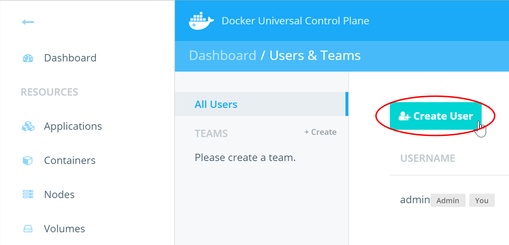

# Docker Datacenter

These tasks for hands-on labs will take you through a typical workflow for Docker Datacenter.
From install, through deploying various applications, and setting up common role-based access control
you will be able to quickly familiarize yourself with the features of Docker Universal Control Plane.

> **Difficulty**: Beginner

> **Time**: Approximately 45 minutes

> **Tasks**:
>
> * [Prerequisites](#prerequisites)
> * [Install UCP](#install-ucp)
> * [Deploy a Container](#deploy-a-container)
> * [Deploy an Application](#deploy-an-application)
> * [Deploy an Application With the UCP UI](#deploy-ucp-interface)
> * [Create Users and Teams](#create-users-teams)
> * [Test User Access](#test-user-access)

## <a name="prerequisites"></a>Prerequisites

- Three VMs with Docker Engine 1.11 Installed
- Each VM will be referred to as Node-0, Node-1, and Node-2

## <a name="install-ucp-controller"></a>Install UCP

Before we begin, we will need to:

1. Install the UCP Controller
2. Add two nodes
3. Install the client bundle

### Install the UCP controller

To install UCP you use the `docker/ucp` image. This image has commands to
install, configure, and backup UCP. To find what commands and options are
available, check the [reference documentation](../reference/install.md).

To install UCP:

1. Log in to your first VM (Node-0) where you will install UCP.  Node-0 will act as your controller node.

2. Use the `docker/ucp install` command to install UCP.

    In this example we'll be running the install command interactively, so that
    the command prompts for the necessary configuration values.
    You can also use flags to pass values to the install command.

    ```bash
    $ docker run --rm -it \
        --name ucp \
        -v /var/run/docker.sock:/var/run/docker.sock \
        docker/ucp \
        install
    ```


3. Check that the UCP web application is running.

    In your browser, navigate to the address where you've installed UCP.

    If you're not using an external CA, your browser warns that UCP is
    an unsafe site. This happens because you're accessing UCP using HTTPS
    but the certificates used by UCP are not trusted by your browser.  


### Attach Nodes

Now that we have our controller-node installed with UCP.  We have to join other nodes to our controller node:

1. Log into your second VM (Node-1) and 
2. Run the UCP join command:

2. Use the join command, to join the node to the cluster:

    ```bash
    $ docker run --rm -it --name ucp \
      -v /var/run/docker.sock:/var/run/docker.sock \
      docker/ucp join -i
    ```

3. Repeat steps 1 and 2 on the other node (Node-2) you want to add to your UCP cluster.
4. Check the cluster state.

    The Dashboard page of UCP should list all your controller nodes.


 
## Download a client certificate

To download a client certificate bundle, **log into UCP**, and navigate to your
**profile page**.


Click the **Create a Client Bundle** button, to download the certificate bundle.


## Use the client certificate

Once you've downloaded a client certificate bundle, you can use it to
authenticate your requests.

Navigate to the directory where you downloaded the bundle, and unzip it. Then
run the `env.sh` script to start using the client certificates.

```bash
$ unzip ucp-bundle-dave.lauper.zip
$ cd ucp-bundle-dave.lauper
$ eval $(<env.sh)
```

The env.sh script updates the `DOCKER_HOST` and `DOCKER_CERT_PATH`
environment variables to use the certificates you downloaded.

From now on, when you use the Docker CLI client, it includes your client
certificates as part of the request to the Docker Engine. You can now use the
`docker info` command to see if the certificates are being sent to the Docker
Engine.

```bash
$ docker info

Containers: 11
Nodes: 2
 ucp: 192.168.99.100:12376
  └ Status: Healthy
 ucp-node: 192.168.99.101:12376
  └ Status: Healthy
Cluster Managers: 1
 192.168.99.104: Healthy
  └ Orca Controller: https://192.168.99.100:443
  └ Swarm Manager: tcp://192.168.99.100:3376
  └ KV: etcd://192.168.99.100:12379
```

## <a name="deploy-a-container"></a>Deploy a container

In this task you will use UCP to deploy a web server from the official NGINX image.

### Deploy a container

In this step you will launch a new container based on the NGINX image using the UCP web UI.

- If you have not already done so, log in to UCP with the built-in **admin** account.
- Click the **Containers** link on left navigation bar.
- Click on **+ Deploy Container** button.
- Fill out the Basic Settings as shown below:


- Expand the **Network** section on the same page and configure the following port mappings:


- Hit the **Run Container** button on the right side panel.

When the operation completes you will see your container listed as shown below. The green circle to the left of the container indicates that the container is in the **running** state.


- Click on the row where the container is listed to see the full container details. Then scroll down to the **Ports** section of the page to check the port mappings.


### Quick Test

In this step you will use your web browser to access the home page of the **nginx_server** container started in the previous step.

In order to access the NGINX container from your web browser you will need the DNS hostname of the node that the container is running on.

- First, let's take a look at the node our **nginx_server** container is running on. In the container details, you can find the node information.


In this particular example, the **nginx_server** container is running on the **node--1** node with an IP of 10.0.18.23- However, this is the private IP address of the node and you will not be able to use this address to connect to the web server. Locate the public IP, or public DNS name, of the node from the lab details you received (each lab machine you have will have a public and priave IP and DNS).

- Go to your web browser and enter the public IP or public DNS name of the node that the **nginx_server** container is running on.

You will see the NGINX welcome page.


You have successfully launched a web container using the Docker UCP web UI

## <a name="deploy-an-application"></a>Deploy A Simple Application With UCP

# Task 4 - Deploy a simple application on UCP

> **Difficulty**: Beginner

> **Time**: Approximately 15 minutes

This task will walk you through the steps of deploying simple applications to Docker UCP. You will complete the following steps in this task.

- Use **Docker Compose** to deploy a web app
- Use the **Client Bundle** to deploy the app
- Deploy and connect to a web app

## Pre-requisites

- You must have [Docker Toolbox](https://www.docker.com/products/docker-toolbox) installed on your local machine

## Step 1 - Deploy an application using Docker Compose

In this step you will use **Docker Compose** to deploy a simple multi-container application. The application contains the following 2 services (containers).

  - Redis
  - A Java client that pings the container to get a response

1. SSH into your UCP controller as the built-in **ubuntu** user.

  Your UCP controller is probably `node-0` in your lab.

2. Use `git` to clone the application repository from https://github.com/johnny-tu/HelloRedis.git

   ```bash
   $ git clone https://github.com/johnny-tu/HelloRedis.git
   Cloning into 'HelloRedis'...
   remote: Counting objects: 45, done.
   remote: Total 45 (delta 0), reused 0 (delta 0), pack-reused 45
   Unpacking objects: 100% (45/45), done.
   Checking connectivity... done.
   ```

   This will clone the repo into a new directory called `HelloRedis` within your home directory - `/home/ubuntu/HelloRedis`.

3. Change directory into `HelloRedis`

  ```bash
  $ cd HelloRedis
  ```

4. List the files in the directory.

   ```bash
   $ ls
   docker-compose.prod.yml  docker-compose.yml  Dockerfile  lib  README.md  src
   ```

5. Use **Docker Compose** to bring up the application defined in the `docker-compose.yml` file. You must run the command from the `HelloRedis` directory.

   ```bash
   $ docker-compose up -d
   Pulling redis (redis:latest)...
   latest: Pulling from library/redis
   ...
   ...
   Digest: sha256:ddb31adb1f61405ee59fc9c569c2b09f1796d0f2190e78d84b873f2d930236c1
   Status: Downloaded newer image for redis:latest
   Creating helloredis_redis_1
   Building javaclient
   Step 1 : FROM java:7
    ---> 9f4357ff2eef
   Step 2 : COPY /src /HelloRedis/src
    ---> eabdb34fe077
   Removing intermediate container fd05659c730a
   Step 3 : COPY /lib /HelloRedis/lib
    ---> 16a65528b2ce
   Removing intermediate container 9f52240204e6
   Step 4 : WORKDIR /HelloRedis
    ---> Running in 686c4bd65d85
    ---> 01d9a0c2a101
   Removing intermediate container 686c4bd65d85
   Step 5 : RUN javac -cp lib/jedis-2.1.0-sources.jar -d . src/HelloRedis.java
    ---> Running in f829db30c628
    ---> 9f08dd8a743c
   Removing intermediate container f829db30c628
   Step 6 : CMD java HelloRedis
    ---> Running in 0e070b1cd994
    ---> 9dc249ef701d
   Removing intermediate container 0e070b1cd994
   Successfully built 9dc249ef701d
   Creating helloredis_javaclient_1

   ```

  This brings up the application defined in `docker-compose.yml`.

6. Run `docker-compose ps` to verify that the application started correctly and is still running.

   ```bash
   $ docker-compose ps
            Name                        Command               State    Ports
   ---------------------------------------------------------------------------
   helloredis_javaclient_1   java HelloRedis                  Up
   helloredis_redis_1        docker-entrypoint.sh redis ...   Up      6379/tcp
   ```

  The output above shows that the Java client service and the Redis database service are both up and running.

7. Open the UCP Web UI with your web browser.

8. Click the **Applications** link on the left navigation bar.

9. You will see the following output

     

10. Click the **Show Containers** link on the right side to view the Redis and Java client containers that make up the application.

   


## Step 2 - Using the Client Bundle

Manually logging into (SSH) the UCP node to run `docker-compose` to deploy your applications is not always convenient, and in a lot of cases is not possible. This is where the **client bundle** helps out.

The **client bundle** sets up your local machine with the certificates and other settings needed for you to issue `docker` and `docker-compose` commands to UCP.

This step is broken up into the following two sub-steps:

  - Configure your environment to use the Client Bundle
  - Deploy the app with the Client Bundle

### Step 2.1 - Configure your environment to use the Client Bundle

1. Navigate to your user profile in UCP.

   

2. Click the **Create a Client Bundle** button. This will download a **zip** file with the necessary keys, certificates, and scripts needed to connect your Docker client to UCP.

   

  Your browser may warn you about the download. Be sure to choose the option to keep the downloaded file.

3. Unzip the **Client Bundle** to a folder of your choice and open a command prompt to that location.

4. List the files in the folder that you have just unzipped the client bundle contents to.

   In this example we are using a Windows machine and we have unzipped the bundle to `C:\Docker\ucp_client_bundles\ucp-bundle-admin`.
   Let's examine the directory using the Windows command prompt (CMD).

   ```
   C:\Docker\ucp_client_bundles\ucp-bundle-admin> dir
    Volume in drive C is OS
    Volume Serial Number is 10D0-EAA3

    Directory of C:\Docker\ucp_client_bundles\ucp-bundle-admin

   20/05/2016  04:54 PM    <DIR>          .
   20/05/2016  04:54 PM    <DIR>          ..
   20/05/2016  04:52 PM             3,684 ca.pem
   20/05/2016  04:52 PM             5,392 cert.pem
   20/05/2016  04:52 PM               450 cert.pub
   20/05/2016  04:52 PM               623 env.cmd
   20/05/2016  04:52 PM               662 env.ps1
   20/05/2016  04:52 PM               609 env.sh
   20/05/2016  05:23 PM    <DIR>          HelloRedis
   20/05/2016  04:52 PM             1,679 key.pem
               7 File(s)         13,099 bytes
               3 Dir(s)  595,220,852,736 bytes free

   ```

   As shown above, the directory contains the TLS keys and certificates, as well as a set of files named `env.cmd`, `env.ps1`, and `env.sh`. The `env.*` files are scripts that configure your current shell/environment so that it can send `docker` and `docker-compose` commands to your UCP controller.

   Windows users can use the `env.cmd` or `env.ps1` scripts. OS X and Linux users can use the `env.sh` script.

   > **Note:** Windows users can opt to use a command line tool such as `git bash` and thus be able to follow the same instructions for Mac and Linux users.

5. Inspect the contents of the `env.sh` file and take note of the environment variables it is setting.

   ```
   export DOCKER_TLS_VERIFY=1
   export DOCKER_CERT_PATH="$(pwd)"
   export DOCKER_HOST=tcp://ec2-54-187-21-127.us-west-2.compute.amazonaws.com:443
   ```

   The `DOCKER_TLS_VERIFY` variable turns on TLS verification between our Docker Client and the Docker Engine you want to communicate with (UCP controller).
   The `DOCKER_CERT_PATH` variable specifies where our TLS certificates and private key is located. In this case it is in the same folder as our `env.sh` script.
   The `DOCKER_HOST` variable specifies the address of the Docker Host you are connecting the client to. In this case your UCP controller node.

6. Execute the script that is appropriate to your Operating System:


  **Windows PowerShell**

  ```
  > . .\env.ps1
  ```

  Note the structure of the command above - the two dots. The first dot tells PowerShell to *dot-source* the script so that the environment variables it sets persist after the script finishes executing. The second dot combined with the backslash tell PowerShell to execute the script from the current directory. There is a space between the two dots but not between the second dot and the backslash :-D

  If your system does not allow the execution of PowerShell scripts you may need to use the `Set-ExecutionPolicy Unrestricted` PowerShell cmdlet to enable script execution. You may have to run this from a PowerShell terminal opened with the `Run as Administrator` option. You may still be prompted to allow this script to execute. If you had to change your execution policy, you may wish to change it back to restricted after executing the script (`Set-ExecutionPolicy Restricted`).

  **Windows command prompt**

  ```
  > env.cmd
  ```

  **Mac OS X and Linux**

  ```
  $ source ./env.sh
  ```

   To verify that that the script worked, check the value of the variables.

  **Windows PowerShell**

  ```
  > GetChildItem Env:
  ```

  The Docker related variables will be listed towards the top.

  **Windows command prompt**

  ```
  > set
  ```

  The Docker related variables will be listed towards the top.

  **Mac OS X and Linux**

   ```
   $ env | grep DOCKER
   ```

7. Now run `docker info` to verify that your local environment has been configured correctly. You should see the UCP controller and nodes listed as shown below.

   ```
   C:\Docker\ucp_client_bundles\ucp-bundle-admin>docker info
   Containers: 17
    Running: 17
    Paused: 0
    Stopped: 0
   Images: 41
   Server Version: swarm/1.1.3
   Role: primary
   Strategy: spread
   Filters: health, port, dependency, affinity, constraint
   Nodes: 3
    ucp-controller: 10.0.15.6:12376
      Status: Healthy
      Containers: 12
      Reserved CPUs: 0 / 1
      Reserved Memory: 0 B / 3.859 GiB
      Labels: executiondriver=, kernelversion=4.2.0-23-generic, operatingsystem=Ubuntu 14.04.4 LTS, storagedriver=aufs
      Error: (none)
      UpdatedAt: 2016-05-24T05:04:06Z
    ucp-node-0: 10.0.7.110:12376
      Status: Healthy
      Containers: 2
      Reserved CPUs: 0 / 1
      Reserved Memory: 0 B / 3.859 GiB
      Labels: executiondriver=, kernelversion=4.2.0-23-generic, operatingsystem=Ubuntu 14.04.4 LTS, storagedriver=aufs
      Error: (none)
      UpdatedAt: 2016-05-24T05:04:20Z
    ucp-node-1: 10.0.28.145:12376
      Status: Healthy
      Containers: 3
      Reserved CPUs: 0 / 1
      Reserved Memory: 0 B / 3.859 GiB
      Labels: executiondriver=, kernelversion=4.2.0-23-generic, operatingsystem=Ubuntu 14.04.4 LTS, storagedriver=aufs
      Error: (none)
      UpdatedAt: 2016-05-24T05:04:23Z
   Cluster Managers: 1
    10.0.15.6: Healthy
      Orca Controller: https://10.0.15.6:443
      Swarm Manager: tcp://10.0.15.6:2376
      KV: etcd://10.0.15.6:12379
   Plugins:
    Volume:
    Network:
   Kernel Version: 4.2.0-23-generic
   Operating System: linux
   Architecture: amd64
   CPUs: 3
   Total Memory: 11.58 GiB
   Name: ucp-controller-ucp-controller
   ID: 44WM:6P6I:N6WZ:U4OB:RFMN:WKY7:OX3N:3OSU:GTE3:3SDC:FROD:OQ6Z
   Labels:
    com.docker.ucp.license_key=4dd1umru9iT8lplNkXi5I1cdZrdxBIl60qyNzB9i6x_b
    com.docker.ucp.license_max_engines=10
    com.docker.ucp.license_expires=2016-05-31 21:53:37 +0000 UTC
   ```

### Step 2.2 - Deploy the app with the Client Bundle

8. Clone the **HelloRedis** repository into another folder of your choice

  ```
  > git clone https://github.com/johnny-tu/HelloRedis.git
  ```

9. Remove the existing HelloRedis application from UCP.

   

10. Launch the application by using the Client Bundle.

   To do this, change directory into the folder that you cloned the `HelloRedis` repo into and run `docker-compose up -d`

   You may notice the following error

   ```
   > docker-compose up -d
   helloredis_redis_1 is up-to-date
   Creating helloredis_javaclient_1
   unable to find a node that satisfies image==helloredis_javaclient
   ....
   ```

   If you look inside the `docker-compose.yml` file, you will see that the `javaclient` service is defined with a `build` instruction. This is not advised on productions runs, especially when Docker Compose is interacting with Swarm or UCP. This is because Compose does not have the ability to build an image across every node in the cluster - Ii will build on the node the container is scheduled on. This can sometimes lead to errors if Swarm tries to schedule a container on a node without the image.

   Best practice for production deployments is to only use pre-built images that are available through Registries such as Docker Hub and Docker Trusted Registry.

11. Inspect the contents of the `docker-compose.prod.yml` with your favorite text editor. Be sure to open the file with **prod** in the name.

  ```
  javaclient:
  image: trainingteam/hello-redis:1.0
  links:
    - redis:redisdb
  redis:
  image: redis
  ```

  Notice that there are no `build` instructions in this file. All images referenced are pre-built images that are on Docker Hub - `trainingteam/hello-redis:1.0` and `redis`.

12. Start the production version of the application with the following command (be sure to use the compose file with **prod** in its name).

  ```
  > docker-compose -f docker-compose.prod.yml up -d
  ```

   The `-f` option lets you tell Docker Compose to use a specific file instead of the default `docker-compose.yml`.

13. Switch to the Docker UCP web UI and click the **Applications** link in the left hand bar.

   Notice that both containers in the app are running on the same UCP node.

   

   This is because the HelloRedis application uses a Compose v1 file as well as container *links*. When you have container links defined,
   Compose will run all linked containers on the same node. However, links are no longer the recommended method for connecting containers. The preferred method is *container networking*, which is supported in v2 Compose files.

You now know how to deploy Docker Compose applications from your local machine using **Client Bundles**.


## <a name="deploy-ucp-interface"></a>Deploy Applications using the UCP Web Interface

### Deploy FoodTruck Application

In this step you'll clone the `FoodTrucks` GitHub repo locally, deploy it to UCP using the UI, and work out how to connect to it with your web browser.

1. Clone the `FoodTrucks` repo to your local machine.

   ```
   $ git clone https://github.com/prakhar1989/FoodTrucks
   Cloning into 'FoodTrucks'...
   remote: Counting objects: 322, done.
   remote: Total 322 (delta 0), reused 0 (delta 0), pack-Recreusede 322ivi
   Receiving objects: 100% (322/322), 2.86 MiB | 823.00 KiB/s, done.
   Resolving deltas: 100% (120/120), done.
   Checking connectivity... done.
   ```

2. Change into the `FoodTrucks` directory that you just cloned the repo into and view the contents of the directory.

   ```
   $ cd FoodTrucks
   $ ls
   aws-compose.yml     Dockerfile  README.md          setup-docker.sh*  utils/
docker-compose.yml  flask-app/  setup-aws-ecs.sh*  shot.png
   ```

3. Return to the UCP web-interface and click on the **Compose Application** button on the **Applications** page


4. On the Create Application window, give your application a name. i.e. "FoodTrucks" and upload the FoodTruck Docker Compose file.
   You can copy and paste the docker-compose.yml file from your FoodTruck applications folder or upload by selecting the file from your PC or Mac.
   Then click on **Create**


- Note the output of the action, then click done.


- You should now see your FoodTrucks application listed on the **Applications** page.

###View the Food Truck App in Your Browser


1. Click on the `foodtrucks` app in UCP.

   This displays the two contaienrs that comprise the app.
   - `foodtrucks_web_1` (the Python app that powers the website)
   - `foodtrucks_es_1` (Elasticsearch backend that powers the search function on the site)

2. Click the `foodtrucks_web_1` web container.

3. Make note of the node and port that it's running on.   

  

   The screenshot above shows the container running on `node--1` and port `5000`.

   The IP address that is shown in the screenshot above is the nodes private IP. You cannot reach this IP address from the internet.

4. Now that you know the node and port the application's web front-end is operating on, make a note of the nodes public IP or DNS name from your lab details.

5. Point your browser to the application.

  To do this, combine the nodes public IP or public DNS with port 5000 as follows:

  - `<public-IP>:5000`
  - `<public-DNS>:5000`

  For example: `http://ec2-54-171-186-72.eu-west-1.compute.amazonaws.com:5000`.

  If you completed all the steps correctly, you will see a very cool application that allows you to search for food trucks in San Francisco.

  

  Congratulations. You've successfully deployed application to Docker UCP using the UCP Web Interface.


## <a name="create-users-teams"></a>Create Users and Teams

In this task you will complete the following four steps.

- Create new users
- Create a team and add users
- Assign permissions to team
- Deploy containers

### Create new users

In this step you will create the 4 new users shown below.

| Username   | Full Name         | Default Permissions |
| :--------- | :---------------- | :------------------ |
| johnfull   | John Full         | Full Control        |
| kerryres   | Kerry Restricted  | Restricted Control  |
| barryview  | Barry View        | View Only           |
| traceyno   | Tracey No         | No Access           |

- Click **Users & Teams** from the left navigation pane.


- Click **Create User**.



- Fill out the **Create User** form with the details provided in the table above. The screenshot below shows the form filled out with the details for the *John Full* user.


> Be sure to make a note of the password that you set for each user. You will need this in future labs.

- Click **Create User**.

Repeat for all users in the table above. Be sure to select the appropriate permissions from the **Default Permissions** dropdown.

> **Note:** The *Default Permissions* configured in the above step are not the same as the permissions you will set in Step - *Default Permissions* apply to non-labelled resources. The permissions you will set in Step 3 will only apply to resources that are labelled appropriately.

### Create a team and add users

Users can be grouped into teams for simpler management.

This step will walk you through the process of creating a team and adding users to the team.

- Create a team called **Engineering** by clicking the ** + Create** button shown in the image below.


- Set the **TEAM NAME** to "Engineering" and make sure **TYPE** is "Managed".

> **Managed** teams have their accounts and passwords managed by UCP rather than an external LDAP service.

- Make sure the Engineering team is selected and click the **Add User to Team** button form the **Members** tab.


- Add all four new users to the team by clicking the **Add to Team** button next to each of them and then click **Done**. Do not add yourself (usually "admin") to the team.

All four users are now members of the Engineering team.

### Assign permissions to team

Labels are central to permissions in Docker UCP.

In this step you will create a new label and assign the Engineering team "View Only" access to that label. In Step 4 you will start a new container and apply that same label to the container. As a result, members of the Engineering team will have "View Only" access to the container.

- With the **Engineering** team selected, go to the **Permissions** tab and click **+ Add Label**.


- Create the following three labels and click **Add Label**.

| LABEL            |   PERMISSION         |
| :-------------   |   :------------------|
| view             |   View Only          |
| restricted       |   Restricted Control |
| run              |   Full Control       |

The labels will now be listed on the **Permissions** tab of the Engineering team.

### Deploy containers

In this step you will start a new container with the "view" label. You will also start one or more container without any label.

- Select **Containers** from the left hand pane, and click **+ Deploy Container**.


- Fill out the Deploy form with the following details and then click **Run Container**.


Repeat the above steps to deploy one or more containers without any label. Be sure to give each container a unique name.

In the next exercise you will explore the implications of running containers with labels.

## <a name="test-user-access"></a>Test User Access

In this task you will complete the following steps:

- Test permission labels
- Test container access from the web UI
- Test container access from the command line
- Test admin access form the command line
- Test default permissions

### Test permission labels

Docker UCP uses labels to implement permissions and access control. In the previous lab (Task 1) you deployed the "nginx1" container with the "view" label. You also assigned the Engineering team "View Only" access to all resources tagged with the "view" label. In this step you will log back in to UCP as "johnfull" and verify that you only have view access to the "nginx1" container.

- Logout of UCP and log back in as user **johnfull**
- Click on the **Containers** link in the left pane.
- Confirm that you can only see the "nginx1" container (with the "view" label). The other containers that you deployed with no labels will not be visible.
- Click the controls button to the right of the container (three dots) and attempt to **Stop** the container. The action will fail and you will see an error message like the one shown below.


- Click on the container to view its details.
- Scroll down to the **Labels** section and verify the presence of the **view** label.


- Click the **Containers** link in the left pane.
- Click the **+ Deploy Container** button to deploy a new container with the following basic options.


  When you click the **Run Container** button, the deployment will fail. This is because members of the Engineering team only have *View Only* access to resources with the **view** label. They cannot create containers with the **view** label.


- Repeat the previous action two more times, but configure the containers as shown in the table below:

| Image Name | Container Name  | Permissions Label |
| :--------- | :---------------| :---------------- |
| ubuntu     | ub1             | restricted        |
| ubuntu     | ub2             | run               |

Deploying with either of these two labels will work. This is because members of the Engineering team have *Restricted Control* on the **restricted** label, and *Full Control* on the **run** label. Both of these permissions allow for the deployment of new containers.

### Test container access from the web UI

In this step you will attempt to perform certain actions while logged in as the **johnfull** user. Depending on which permissions labels are in force will determine whether these actions succeed or fail.

- Click on the container **ub1**. Then click the **Console** tab.


- Click on the **Run** button with "bash" specified in the field.

This action is the GUI equivalent of running a `docker exec` command. In this case, you are trying to execute a `bash` terminal inside the **ub1** container.

You will get an error message saying *Error attempting to open exec session*. This is because the you are logged in as **johnfull** who is a member of the **Engineering** team, and the **Engineering** team only have *Restricted Control* to the **ub1** container via the **restricted** label. *Restricted Control* does not allow you to open exec sessions to a container.

- Now try the same thing with the **ub2** container.

This time the bash terminal will launch successfully. This is because the user **johnfull** is a member of the **Engineering** team which has *Full Control* over the **ub2** container via the **run** label.


### Test container access from the command line

In this step you will create and download a **client bundle** for the **johnfull** user, connect to UCP using the client bundle, and perform some tests from the command line. You can do this from either a Windows or Mac. The steps below are from a Windows machine.

- Click the **johnfull** dropdown in the top right corner and select **Profile**.

- Scroll to the bottom of the profile screen and click **Create a Client Bundle**.

This will download the client bundle to your local machine as a zipped archive file.

- Unzip the contents of the archive file and open a command prompt to the location of the extracted contents. On a Windows machine this is likely to be C:\Users\your-user\Downloads\ucp-bundle-johnfull.

The examples in this tutorial are using Git Bash. Feel free to use a command line tool of your choice.

- List the files in your current directory.

```
nigel@surfacewah MINGW64 ~/Downloads/ucp-bundle-johnfull
$ ls
ca.pem  cert.pem  cert.pub  env.cmd  env.ps1  env.sh  key.pem
```

- Execute the `source.sh` shell script.

```
nigel@surfacewah MINGW64 ~/Downloads/ucp-bundle-johnfull
$ source env.sh
```

- Run a `docker ps` command to list the containers.

The output should contain the "nginx1", "ub1", and "ub2" containers created in the previous steps.

```
nigel@surfacewah MINGW64 ~/Downloads/ucp-bundle-johnful
$ docker ps
CONTAINER ID   IMAGE      COMMAND                  CREATED             STATUS              PORTS             NAMES
26483416a3ef   ubuntu     "/bin/bash"              About an hour ago   Up About an hour                      ub2
656e3e4c0ccf   ubuntu     "/bin/bash"              About an hour ago   Up About an hour                      ub1
0fe093853832   nginx      "nginx -g 'daemon off"   About an hour ago   Up About an hour    80/tcp, 443/tcp   nginx1
```

- Run `docker exec -it ub1 bash` to open a `bash` terminal on the "ub2" container.

This will result in an *Error response from daemon: access denied* error. This is because the "ub1" container is tagged with the "restricted" label, which maps the *Restricted Control* permission to members of the Engineering team.

- Repeat the same command for the **ub2** container.

This time the command works because the **ub2** container is tagged with the **run** label which maps the *Full Control* permission to members of the Engineering team. Restricted Control does not allow users to `docker exec` into a container.


### Test admin access form the command line

In this step you will attempt to launch a console form the UCP web UI, as well as the **admin** user's client bundle.

- Logout of UCP as **johnfull** and log back in as the **admin** user
- Click the **Containers** link in the left of the web UI and click the **ub1** container.
- Click the **Console** tab and then click the **Run** button to run a `bash` terminal.

This time the terminal opens. This is because the "admin" user has full access to all UCP resources, regardless of permissions labels that are applied.

- Download the Admin user's client bundle and unzip to a folder of your choice.  See steps 3.1-3.3 for details of how to do this.
- Open a command prompt to the location of the unzipped client bundle and execute the `env.sh` script.
- Run a `docker ps` command and take note of how many containers you can see.

You should see the **nginx1**, **ub1** and **ub2** containers that were launched in Step - You should also see any additional containers that you launched without permissions labels at the end of Task 1.

- Run `docker exec` and open a `bash` terminal to the "ub1" container

The operation will also succeed because you are connected to UCP as the **admin** user.

### Test default permissions

In this step you will test access to UCP resources that are not tagged with permissions labels. The actions in this step wil be performed in the Docker UCP web UI.

- Logout of UCP as the **admin** user and log back in as **johnfull**.
- Click on the **Images** link and click **Pull Image**.
- Pull the "hello-world" image.


The image pull operation will be successful.

- Click on the **Networks** link and click **+ Create Network** to create a new network called "johns-net".

Just give the network a name and click **Create**.

The network will be successfully created.

From the previous 4 steps we can see that the user **johnfull** has full access to create networks, pull images, and perform other UCP tasks. This is because **johnfull** has the *Full Access* default permission, giving him full access to all non-tagged UCP resources. His access is only restricted to resources tagged with permissions labels.

- Logout of UCP as **johnfull** and log back in as **kerryres**.
- Click on the **Images** link and pull the "alpine" image.
- Click on the **Networks** link and create a network called "kerry-net".

Similar  to **johnfull**, **kerryres** can also pull images and create networks despite only having the **Restricted Control** default permission. However, there are actions that users with Full Control can do, that users with Restricted Control cannot do such as `docker exec` into containers and lauch **privileged** containers.

- Logout of UCP as **kerryres** and log back in as **barryview**.
- Click on the **Images** link.

Notice that Barry does not even have a **Pull Image** button. This is because **barryview** has the **View Only** default permission. This permission does not allow operations such as pulling images.

- Click the **Networks** link and create a network called "barry-net".

You will get an **Error creating network: access denied** error message because of insufficient permissions.

- Logout of UCP as **barryview** and login as **traceyno**.
- Notice that Tracey only has links to the following three resource types:
  - Applications
  - Containers
  - Nodes

This is because Tracey has the **No Access** default permission. However, because Tracey is a members of the Engineering team, she gets access to all of the tagged resources that the Engineering team has access to.

- Click the **Containers** link and notice that Tracey can see the three containers that have the **view** label attached to them.
