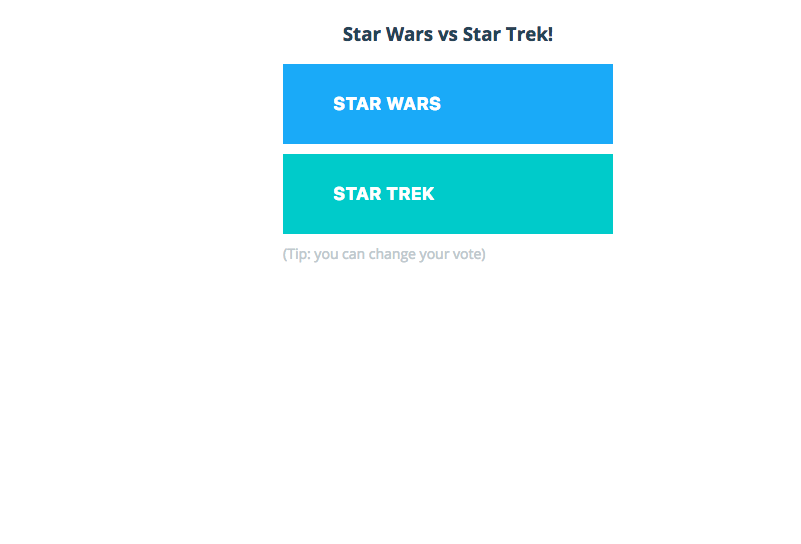

# Lab 3: Docker for Developers

> **Difficulty**: Beginner

> **Time**:  20 minutes

> **Tasks**:
> 
> + [Prerequisites]()
> 
> 	+ [Install Docker for Desktop]()
> 	+ [Run Docker for Desktop]()
>  + [Understand Key Functionalities]()
>  + [Build and Deploy and App]()

## What is Docker for Desktop (Mac/Windows) ?

Docker for Mac and Docker for Windows are faster, more reliable alternatives to Docker Toolbox for running Docker locally on your Windows or Mac. It features the following:

**Faster and more reliable**- No more VirtualBox! On Mac, the Docker Engine runs in an xhyve Virtual Machine (VM) on top of an Alpine Linux distribution. The VM is managed by the native Docker application. On Windows, the Docker Engine is running in a Hyper-V VM. You do not need Docker Machine (docker-machine) to run Docker for Mac and Docker for Windows.

**Native apps for better tools integration** - Docker for Mac and Docker for Windows are native applications, including native user interfaces and the ability to stay updated automatically. The Docker tools are bundled with these apps, including the Docker command line interface (CLI), Docker Compose, and Docker Machine.

**Use with Docker Toolbox and Docker Machine** - Docker for Mac and Docker for Windows can be used at the same time as Docker Toolbox on the same machine. Docker for Mac and Docker for Windows do not include Kitematic yet. So, for now, the only reason you would still need both Toolbox and Docker for Mac or Windows is to run Kitematic. (See Docker for Mac vs. Docker Toolbox in the Mac documentation. A Windows-specific version is coming soon.)

**Volume mounting for your code and data** - Volume data access is fast and works correctly.

**Support for multiple architectures out-of-the-box** - Docker for Mac and Windows lets you build and run Docker images for Linux x86 and ARM. (See Leveraging Multi-Architecture Support in the Mac documentation. A Windows-specific version is coming soon.)

Please go through the tutorial based on the platform you're using:

## Docker for Mac


1. Install Docker for Mac
2. Run Docker for Mac
3. Understand Key Functionalities
4. Build and Deploy an App 

In this step, we will show the power of file syncing when it comes to developing your application locally with Docker for Mac. You can easily sync any file from your local machine into the container running on Docker for Mac. As you're changing your code, you'll see the changes take effect right away. 

**Step 1:** Let's start by cloning the imfamous voting app into your local directory.

```
$git clone https://github.com/docker/example-voting-app.git
```

**Step 2:** Examine the docker-compose file to understand how the application is deployed:

```
$cat example-voting-app/docker-compose.yml
version: "2"

services:
  voting-app:
    build: ./voting-app/.
    volumes:
     - ./voting-app:/app
    ports:
      - "5100:80"
    links:
      - redis
    networks:
      - front-tier
      - back-tier

  result-app:
    build: ./result-app/.
    volumes:
      - ./result-app:/app
    ports:
      - "5101:80"
    links:
      - db
    networks:
      - front-tier
      - back-tier

  worker:
    build: ./worker
    links:
      - db
      - redis
    networks:
      - back-tier

  redis:
    image: redis:alpine
    ports: ["6379"]
    networks:
      - back-tier

  db:
    image: postgres:9.4
    volumes:
      - "db-data:/var/lib/postgresql/data"
    networks:
      - back-tier

volumes:
  db-data:

networks:
  front-tier:
  back-tier:
```

You can see that for both the `voting-app` and `result-app` services, a host directory is mounted into the container. For example, the directory called `voting-app` is mounted into the cotnainer at `/app`. You can exampin the `./voting-app/app.py` Python file as follows:


```
$ cat ./voting-app/app.py
from flask import Flask, render_template, request, make_response, g
from redis import Redis
import os
import socket
import random
import json

option_a = os.getenv('OPTION_A', "Cats")
option_b = os.getenv('OPTION_B', "Dogs")
hostname = socket.gethostname()

app = Flask(__name__)

def get_redis():
    if not hasattr(g, 'redis'):
        g.redis = Redis(host="redis", db=0)
    return g.redis

@app.route("/", methods=['POST','GET'])
def hello():
    voter_id = request.cookies.get('voter_id')
    if not voter_id:
        voter_id = hex(random.getrandbits(64))[2:-1]

    vote = None

    if request.method == 'POST':
        redis = get_redis()
        vote = request.form['vote']
        data = json.dumps({'voter_id': voter_id, 'vote': vote})
        redis.rpush('votes', data)

    resp = make_response(render_template(
        'index.html',
        option_a=option_a,
        option_b=option_b,
        hostname=hostname,
        vote=vote,
    ))
    resp.set_cookie('voter_id', voter_id)
    return resp


if __name__ == "__main__":
    app.run(host='0.0.0.0', port=80, debug=True)

 
```

You can see that the voting used two voting options **a** and **b** that default to **Cats** and **Dogs** respectively. Let's deploy the app and see how it looks!

**Step 3:** Build and Deploy the voting app using docker-compose

```
$cd example-voting-app
example-voting-app$ docker-compose up -d
```

The app will take some time to build but once it's done you can check the status as follows:

```
example-voting-app$ docker-compose ps
            Name                           Command               State            Ports
------------------------------------------------------------------------------------------------
examplevotingapp_db_1           /docker-entrypoint.sh postgres   Up      5432/tcp
examplevotingapp_redis_1        docker-entrypoint.sh redis ...   Up      0.0.0.0:32768->6379/tcp
examplevotingapp_result-app_1   node server.js                   Up      0.0.0.0:5001->80/tcp
examplevotingapp_voting-app_1   python app.py                    Up      0.0.0.0:5000->80/tcp
examplevotingapp_worker_1       java -jar target/worker-ja ...   Up

```

To access the app, you can go to yoru favorite browser and hit `localhost:5000`


**Step 4:** Now let's tweak the voting options on the go and see the effect take place right away!

Using your favorite text editor, edit `app.py` and changes the voting options:

 
 ```
 # cat voting-app/app.py
from flask import Flask, render_template, request, make_response, g
from redis import Redis
import os
import socket
import random
import json

option_a = os.getenv('OPTION_A', "Star Wars")
option_b = os.getenv('OPTION_B', "Star Trek")
 ```
 
Save your edits, and refresh the page !




**Summary**

Docker for Mac is the fastest, most reliable, and native way to use Docker on your Mac. Througout this tutorial, we learned how to install and run Docker for Mac. We also deployed an application and used the robust file-syncing to see changes in the application code right away without restarting or de-deploying the application containers!


## Docker for Windows
