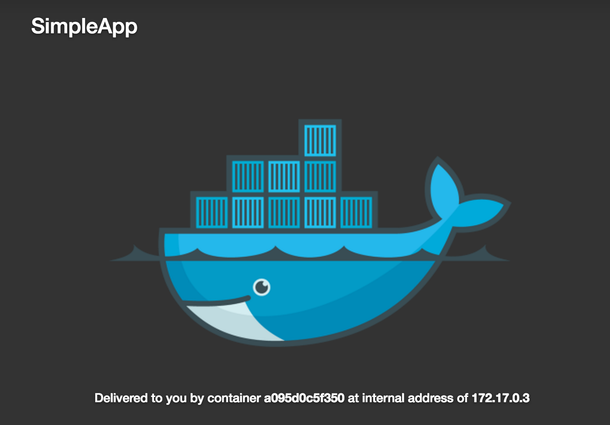

#Orchestration with Docker Clustering

#####Prerequisites
* You will be using __node0__, __node1__, and __node2__
* Ensure that no containers are running on these nodes ```$ docker rm -f $(docker ps -q)```
* 


##Task 1: Deploy a Simple Application
#####Set Up Environment

1. Connect to __host0__
2. Use the following command to clone the simple app repo from GitHub to node-0

```
node-0:$ git clone https://github.com/mark-church/simple.git
Cloning into 'simple'...
remote: Counting objects: 2628, done.
remote: Compressing objects: 100% (1706/1706), done.
remote: Total 2628 (delta 864), reused 2628 (delta 864), pack-reused 0
Receiving objects: 100% (2628/2628), 11.18 MiB | 9.39 MiB/s, done.
Resolving deltas: 100% (864/864), done.
Checking connectivity... done.
```
3. Change directory to ```simple`` and examine the list of files in the repo

```
$ cd simple
$ tree
```
SimpleApp is a basic Flask application. It has a built in webserver that serves up a webpage at the address that the application is bound to. It's comprised of several python files in addition to _index.html_ which is the template file for page that is served by the application. 

The other file in this directory is the __Dockerfile__. A Dockerfile is a text document that contains all the commands a user could call on the command line to assemble an image. This includes packages that the application will need, directories of data that needs to be a part of the image, and any metadata that should be shipped in the image. The Docker engine uses Dockerfiles to create new container images.

Next we will use a Dockerfile to create an image and then run a container from that image.

#####Build the Application
1. Verify that the Docker is running on __host0__

```
$ docker version
Client:
 Version:      1.11.1
 API version:  1.23
 Go version:   go1.5.4
 Git commit:   5604cbe
 Built:        Wed Apr 27 00:34:20 2016
 OS/Arch:      darwin/amd64

Server:
 Version:      1.11.1
 API version:  1.23
 Go version:   go1.5.4
 Git commit:   8b63c77
 Built:        Tue May 10 10:39:20 2016
 OS/Arch:      linux/amd64
```

2. Go to the simpleDir directory

```
$ cd simpleDir
```


3. Inspect the Dockerfile to see how its parameters will build the container image

```
$ cat Dockerfile
FROM ubuntu

RUN sudo apt-get update && apt-get -y install python-pip

RUN sudo pip install flask

COPY / /simpleDir

WORKDIR /simpleDir

RUN chmod a+x /simpleDir/run.py

CMD ["python", "/simpleDir/run.py"]
```
__FROM__:

__ADD__:

__RUN__:

__CMD__:


4. Build the image specifying the directory of the Dockerfile and tagging the image with a name

```
$ docker build -t simple-app .
Sending build context to Docker daemon 46.37 MB
Step 1 : FROM ubuntu
 ---> 97434d46f197
Step 2 : RUN sudo apt-get update && apt-get -y install python-pip
 ---> Using cache
 ---> b0cb7f91182a
Step 3 : RUN sudo pip install flask
 ---> Using cache
 ---> 48341a27ddae
Step 4 : COPY / /simpleDir
 ---> d4624e790810
Removing intermediate container ff6acef54740
Step 5 : WORKDIR /simpleDir
 ---> Running in 5b72131e12d4
 ---> ae4e569e3e78
Removing intermediate container 5b72131e12d4
Step 6 : RUN chmod a+x /simpleDir/run.py
 ---> Running in 38d3b00b2543
 ---> e5f7ccf32e83
Removing intermediate container 38d3b00b2543
Step 7 : CMD python /simpleDir/run.py
 ---> Running in 0c8d994d23ce
 ---> 6b249f008fee
Removing intermediate container 0c8d994d23ce
Successfully built 6b249f008fee
 ```
 
3. See that the image is now in the local image repository of the Docker engine

```
$ docker images
REPOSITORY                             TAG                         IMAGE ID            CREATED             SIZE
simple-app                             latest                      6b249f008fee        13 minutes ago      418.6 MB

```


We have now built a new container image using the Dockerfile and the contents of the directory that we cloned from GitHub.

#####Run the Application
1. Now create a container with our simple-app image and run it on __host0__ at port 80

```
$ docker run -it -p 5000:5000 simple-app
a81a20cdb00d486601b57dba9b02c31c8272400ea67b9122a8a177c0b465d568
```

2. Verify through the Docker CLI that the container is running

```
$ docker ps
a81a20cdb00d        simple-app          "python /simpleDir/ru"   13 minutes ago      Up 3 seconds        0.0.0.0:5000->5000/tcp   tiny_elion
```
From this output we can see the following:   

* The container has been given an automatically generated ID and name (we can specify the name if we choose)
* We can see what image was used to create the container
* We can also see if and how the container is exposed outside the host (in this case on port 5000 of the host interfaces)

3. Lastly, let's use the browser to connect to our live container. Look up the public facing IP address of __host0__. Type ```http://<ip address>:5000``` into the browser and you will see your container running.

You should see the following ...
<p align="center">

</p>


##Task 2: Start a Docker Cluster
Up until this point we have been dealing with a single-container application on one host. Real-world applications are typically many apps across hosts that may even be in different environments. The Docker ecosystem has powerful tools to scale and manage large applicaion


#####Set Up Docker Clustering
1. Create swarm controller

```
$ docker swarm create --listen-addr <IP>:4500
 ```
 
2. View containers on controller host

```
$ docker ps
...
```

3. Join the other hosts to the swarm cluster

```
$ docker swarm join <IP>:4500
```
4. View the cluster

```
$ docker node ls
...

$ docker swarm info
...

```


##Task 3: Deploy a Multi-Service, Multi-Host Application

#####Deploy Application
1. Examine compose file

```
$ cat compose.yml

```
######Compose Deployment Options
__image__:

__build__:

__expose__:

__ports__:

__networks__:

__volumes__:


1. ```docker login```
2. ```docker-compose build build-compose.yml```
3. ```docker push```
4. ```docker-compose run-compose.yml up```
5. ```docker ps``` 
6. Go to application

#####Explore Application
1. ```docker inspect container```
2. ```docker network inspect net```
3. show labels on worker nodes and infrastructure node

#####Cluster and Application Operations
1. Scale front-end web server to 3 
2. Hit front-end and show different containers serving up the web page
3. Rolling update of application
4. Kill host
5. ```docker ps``` and see container rescheduled


